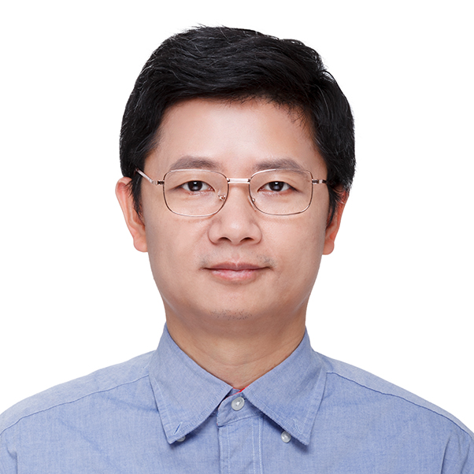

**危夷晨**
==========
 

 

<!--- do not know how to resize the image --->
<!---  --->

<!--- comment ---> 

switch to [English homepage](index.html)。

#### **数坤科技研发副总裁**

电子邮件: weiyichen at shukun.net

我于2021年11月加入[数坤科技](https://www.shukun.net/)。在此之前，我在[旷视科技](https://megvii.com/)任上海研究院院长3年，在[微软亚洲研究院](https://www.msra.cn/)视觉计算组工作了12年。我于2006年在香港科技大学获得博士学位，于2001年在北京大学获得学士学位。

我的研究方向为深度学习和计算机视觉。

我的[谷歌学术](https://scholar.google.com/citations?hl=en&pli=1&user=O7A6nYMAAAAJ)引用数约为23,000, h指数为48。

我在微软期间的研究工作成功转化到微软的产品，包括[Kinect 身份识别](https://ieeexplore.ieee.org/document/5742015/), [Windows Hello](https://www.youtube.com/watch?v=1AsoSnOmhvU), [微软认知服务](https://azure.microsoft.com/en-us/services/cognitive-services/), 必应, Office, and 微软小冰, 等等。

##### 动态

- 2022年3月, 我在机器之心AI科技年会上作了主题为“AI在医疗影像的应用和探索”的[宣讲](https://www.bilibili.com/video/BV11u411v7CZ/?spm_id_from=333.999.0.0).
- 2019年11月，我在将门创投进行了一个技术[宣讲](https://www.bilibili.com/video/av77388408) ，主题为 "不确定性估计在计算机视觉中的应用"。
- 2019年4月，我们关于[AutoML](https://arxiv.org/abs/1904.00420)的工作获得一些公众报道（[新智元](https://mp.weixin.qq.com/s/Dmml7DrujXnOAEhU7vugmw), [机器之心](https://mp.weixin.qq.com/s/0_zFoMUh-4s8BKl2rSzmig), [量子位](https://mp.weixin.qq.com/s/pCsZi7INorI0HN7o5zf1Bw), ...）。
- 2019年1月, 我接受了"数据科学50人" 栏目的[采访](https://new.qq.com/omn/20190110/20190110A0G9OG.html)。
- 2019年7月，我接受了新智元的[采访](https://baijiahao.baidu.com/s?id=1607139006385580393&wfr=spider&for=pc)。

##### 代表性研究工作

- [Deformable Convolutional Networks](https://arxiv.org/abs/1703.06211) ranks [6th of the most influential papers in ICCV 2017](https://www.paperdigest.org/2023/01/most-influential-iccv-papers-2023-01/) and won 3rd place in object detection task of [COCO Challenge 2017](https://places-coco2017.github.io/#winners).
- [Single path one-shot neural architecture search with uniform sampling](https://arxiv.org/abs/1904.00420) ranks [9th of the most influential papers in ECCV 2020](https://www.paperdigest.org/2023/01/most-influential-eccv-papers-2023-01/).
- [Simple Baselines For Human Pose Estimation And Tracking](https://arxiv.org/abs/1804.06208) ranks [12th of the most influential papers in ECCV 2018](https://www.paperdigest.org/2023/01/most-influential-eccv-papers-2023-01/), won 1st place in the [PoseTrack2018 Multi-person Pose Tracking Challenge](https://posetrack.net/workshops/eccv2018/posetrack_eccv_2018_results.html) and 2nd place of  [keypoint detection task of COCO 2018](http://cocodataset.org/#keypoints-leaderboard).
- [Face Alignment by Explicit Shape Regression](https://yichenwei.github.io/publications/CVPR12_FaceAlignment.pdf) ranks [12th of the most influential papers in CVPR 2012](https://www.paperdigest.org/2023/01/most-influential-cvpr-papers-2023-01/).
- [Saliency Optimization from Robust Background Detection](https://yichenwei.github.io/publications/CVPR14_SaliencyOptimization.pdf) ranks [14th of the most influential papers in CVPR 2014](https://www.paperdigest.org/2023/01/most-influential-cvpr-papers-2023-01/).
- [Rethinking on Multi-Stage Networks for Human Pose Estimation](https://arxiv.org/abs/1901.00148)  won 1st place in [keypoint detection](http://cocodataset.org/index.htm#keypoints-2019) task of  [COCO and Mapillary Challenge 2019](http://cocodataset.org/workshop/coco-mapillary-iccv-2019.html).
- [Fully Convolutional Instance-aware Semantic Segmentation](https://arxiv.org/abs/1611.07709) won 1st place in object segmentation task of [COCO Challenge 2016](http://image-net.org/challenges/ilsvrc+coco2016).
- [Integral Human Pose Regression](http://openaccess.thecvf.com/content_ECCV_2018/papers/Xiao_Sun_Integral_Human_Pose_ECCV_2018_paper.pdf) won the 2nd place of  [ECCV 2018 3D Human Pose Estimation Challenge](http://vision.imar.ro/human3.6m/ranking.php).

##### [发表论文（按时间顺序）](publications.html)

##### [发表论文（按主题顺序）](publications_in_topic.html)

最近修改于: 2023年3月9日
